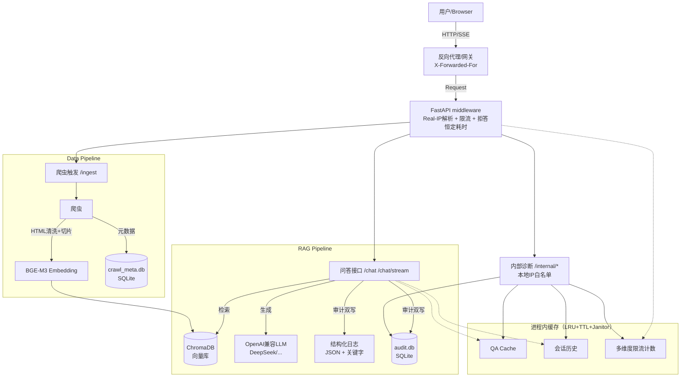

# DocMind (search-ai) - 系统功能与技术概览

> 一句话定位：面向外网开放的轻量级 RAG 问答助手。**不依赖任何外部数据库**（无 Redis、无 MongoDB），单进程嵌入式存储，启动只需 `bash run.sh`。

---

## 📚 一、系统功能介绍 (System Features)

### 1. 核心问答能力
- **检索增强问答 (RAG)**：自然语言提问 → 向量检索 → 调用 LLM 生成有上下文支撑的回答
- **来源溯源 (Source Citing)**：每个回答附带参考的文档 URL，可核验
- **多语言自适应**：自动识别提问语言并同语言回复（中/英）；中文提问可检索英文文档（BGE-M3 多语言向量能力）
- **建议追问 (Smart Suggestions)**：每次回答后 LLM 自动生成 3 个相关追问，语言严格跟随当前会话

### 2. 交互体验
- **流式响应 (SSE)**：打字机效果实时输出，首字延迟极低
- **会话隔离**：每个浏览器标签 `sessionStorage` 维护独立 `session_id`；后端 LRU + 30min TTL；不同 session 严格隔离
- **历史侧边栏**：当前会话的提问可点击回溯（平滑滚动 + 高亮定位）
- **反馈机制**：每条回答 👍/👎，👎 可填写"不满意原因"（≤500 字）

### 3. 知识库管理
- **自动化爬虫**：BFS 抓取，可配置最大页数 + 域内过滤
- **数据清洗**：去除 nav / footer / TOC 等噪音，保留正文与代码块
- **增量更新**：内容 hash 比对，只重 embedding 改动过的页面
- **失效清理**：本次任务未爬到的旧 URL 标记 deleted，同步从向量库移除

### 4. 安全与风控（**对外服务的核心投入，详见 README**）

15 项防御层，覆盖：
- 多维度限流（IP / session / /24 子网 / 全局 RPM，任一超阈值即 429）
- 每日 LLM token 预算（防"账单攻击"）
- 同问题短时去重（防爬库脚本）
- SSE chunk 超时（防挂连接耗资源）
- 拒答恒定耗时（抹平响应时间侧信道）
- 反向代理真实 IP 解析（XFF + 可信代理白名单）
- 提示注入与越权指令拦截
- 检索相关度阈值（无关提问不调 LLM）
- 输入合规（前后端双重校验）
- 内存配额（LRU + TTL + 后台 janitor，无 OOM 风险）
- 审计/反馈结构化双写（JSON 日志 + SQLite）
- 内部诊断 API 严格本地化（IP 白名单，不信任 XFF）
- 全局 + 单 IP 并发治理
- 会话隔离与隐私
- 日志滚动（无磁盘炸盘风险）

---

## 🛠️ 二、技术栈 (Tech Stack)

### 1. 后端
- **核心框架**：Python 3.9+ / **FastAPI**（异步、I/O 密集型友好、自动 OpenAPI 文档）
- **ASGI 服务器**：**Uvicorn**（基于 uvloop）
- **流式协议**：**SSE** (sse-starlette) — 比 WebSocket 轻量，问答场景天然适配
- **配置**：pydantic-settings 从 `.env` 自动加载

### 2. AI 与数据
- **LLM**：**DeepSeek V3** 默认（OpenAI 兼容协议，可替换任何兼容网关）
- **Embedding**：**BAAI/bge-m3** 本地模型（多语言，支持 8192 token 长文本）
- **向量库**：**ChromaDB**（嵌入式持久化，无独立服务）
- **RAG 编排**：自研 pipeline（不引入 LangChain，逻辑透明可控）

### 3. 嵌入式存储（替代 Redis/Mongo）
- **`audit.db`**（SQLite）：qa_audit + user_feedback 两张表
  - 滚动保留 30 天（`AUDIT_RETENTION_DAYS` 可调）
  - 写入路径：每次问答 / 用户反馈"日志 + SQLite"双写
  - 查询路径：本地 `/internal/audit`、`/internal/feedback` API
- **`crawl_meta.db`**（SQLite）：爬虫 documents 元数据
  - url 主键 + 内容 hash + status (active/deleted)
  - 默认随 `data/` 一起 gitignore；如需"clone & run 就有知识库"，可在打 docker 镜像时把它和 ChromaDB 目录一起 COPY 进去
- **进程内 LRU 缓存**：QA 答案 / 会话历史 / IP 限流计数
  - 通用 `TtlLruCache` + `SlidingWindowCounter`，三重保护（上限 + TTL + 后台 janitor）

### 4. 可观测性
- **structlog JSON 日志**：每条带 `request_id`，全链路可追踪
- **关键字日志**：`event=qa_audit` / `event=user_feedback` / `event=rate_limit_ip` 等，grep + jq 可检索
- **RotatingFileHandler**：100MB × 10 滚动，磁盘炸盘有底
- **内部诊断 API**：`/internal/cache-stats` 查内存涨没涨，`/internal/token-budget` 查当日预算

### 5. 前端
- **核心**：原生 HTML5 + JavaScript (ES6+)，无重型框架
- **样式**：TailwindCSS (CDN)
- **Markdown 渲染**：Marked.js（代码高亮、表格、链接）

---

## 📊 三、架构图



**关键设计点**：

- 所有外部依赖都在右侧（LLM API、用户浏览器），中间件 / 缓存 / 存储全是嵌入式
- 审计数据**绝不进向量库**：架构上隔离，攻击者无法通过 RAG 提问拿到"别人问了什么"
- 限流计数、并发 semaphore、QA cache 都是进程内，无网络往返；多实例部署需要前置网关或共享 KV

---

## 💻 四、运行资源需求

### 推荐配置（单实例对外服务）

| 资源 | 推荐 | 最低 | 说明 |
|---|---|---|---|
| CPU | 2 vCore | 1 vCore | 无 GPU 也能跑；BGE-M3 在 CPU 上 embedding 一段约 50-200ms |
| 内存 | 4 GB | 2.5 GB | 进程基线 ~500MB + BGE-M3 模型常驻 ~2.3GB + 缓存配额 + LLM 调用峰值 |
| 磁盘 | 5 GB+ | 3 GB | 模型 ~2.5GB + ChromaDB 知识库（与页数线性，50 页 ~10MB）+ audit.db（保留 30 天约百 MB）+ 日志（100MB × 10） |
| 网络 | 出站 HTTPS | - | 仅依赖 LLM API 出站（DeepSeek/OpenAI 兼容网关）；入站 80/443 + 服务端口 8100 |

### 实测数据

- **冷启动时间**：~7 秒（含 BGE-M3 模型加载）。模型加载后所有请求 < 100ms（向量检索）+ LLM 端到端
- **首字延迟（SSE）**：300-800ms（LLM 网关耗时主导）
- **单 IP 默认配额**：12 RPM / 3 并发 / 30 session，可按业务调整
- **全实例配额**：默认 20 并发 + 300 RPM，单 4G 实例可稳定承载 ~100 QPS 短时峰值
- **每日 token 预算**：默认不启用；建议生产按月度预算 ÷ 30 设置（防账单攻击）

### 进程模型

- **单进程单实例**：默认 uvicorn 单 worker；内存缓存 + 限流计数都是进程内
- **多实例部署需要外部协调**：
  - 限流 → 前置网关（nginx / cloudflare）做 IP 限流；或迁移到共享 KV（Redis/etcd）
  - QA 缓存 → 命中率会因实例分散下降，可接受 / 或前置统一缓存
  - 审计 SQLite → 单实例足够；多实例建议改写到共享存储（KV/PG）
- **嵌入式 SQLite 的并发上限**：WAL 模式下"多读单写"，单实例 demo 量级毫无压力

### 不需要的资源

- ❌ Redis / MongoDB / MySQL / 任何外部数据库
- ❌ Docker（可选用 Dockerfile 打包镜像，但运行不强制依赖）
- ❌ GPU（BGE-M3 CPU 推理对 demo 量级足够）
- ❌ 消息队列 / 任务调度器

---

## 🚀 五、部署形态

### 形态 1：单文件镜像（推荐）

`crawl_meta.db` + `chromadb/` 入 repo，构建镜像时一并打包：

```
docker build .       # 镜像内含模型 + 知识库 + 代码
docker run -p 8100:8100 -e LLM_API_KEY=... <image>
```

`git clone && bash run.sh` 也能直接启动（不走 docker）。

### 形态 2：源码运行

```bash
pip install -r requirements.txt
# 配 .env (LLM_API_KEY / TARGET_URL)
bash run.sh                # dev (--reload)
bash run.sh --prod         # prod
```

知识库构建：
```bash
curl -X POST "http://localhost:8100/api/v1/ingest" -H "Content-Type: application/json" -d '{"url":"...","max_pages":50}'
```

---

## 📦 六、目录结构（精简版）

```text
search-ai/
├── app/
│   ├── api/v1/         chat / ingest / internal
│   ├── core/           config / cache / security / net / sqlite_store / crawl_store / token_budget / logger
│   ├── services/       crawler / llm_service / vector_service
│   ├── static/         Web UI (单文件 HTML)
│   └── main.py
├── data/               audit.db + crawl_meta.db + chromadb/   ← 知识库可入 repo
├── models/             BGE-M3 模型
├── scripts/            ingest_cli.py 等
├── tests/
├── .env                # LLM_API_KEY / TARGET_URL / 各种安全配置项
├── requirements.txt    # 极简：FastAPI + uvicorn + aiosqlite + chromadb + bge-m3 + structlog
├── run.sh / stop.sh    # 一键启停（无 docker 依赖）
└── Dockerfile          # 可选：打镜像用
```

---

## 📝 七、关键演进里程碑

- **轻量化重构（已完成）**：移除 Redis（之前已是死代码）、MongoDB → SQLite；不再依赖任何外部数据库；`run.sh` 不再依赖 docker
- **安全加固（已完成）**：从单维度 IP 限流 → 4 维度叠加（IP / session / /24 子网 / 全局）；新增每日 token 预算、同问题去重、SSE 超时、拒答恒定耗时、XFF 真实 IP 解析、内部 API 本地白名单
- **内存防泄漏（已完成）**：4 个按 IP/session 为 key 的永生 dict 全部改为 `TtlLruCache` + 后台 janitor，单实例可承载 10000 个 IP 维度键
- **审计可查询（已完成）**：从纯 Mongo collection → 日志关键字 + SQLite 表双写 + `/internal/audit /feedback` 本地查询 API

---

## 🔮 八、规划项（未实施，仅记录）

- 多模态：PDF/Office 文件抽取 / 图片 OCR / 音视频 ASR → 接入现有索引链路
- CSP / HSTS / 安全响应头：建议由前置网关统一落地
- 管理员后台 UI：基于 `/internal/*` API 包装一个内部 Web 界面（热门问题、👎 趋势、ingest 触发）
- PoW / Captcha 挑战：连续触发限流 N 次后强制；目前留 hook，未启用
